# 二、进程管理
## 1. 进程的概念、组成、特征
程序与进程的区别：
- 程序：<font color=FF0000>静态</font>的，是一系列的指令集和
- 进程：<font color=FF0000>动态</font>的，是程序的一次执行过程

进程的组成：
- PCB(进程控制块)
  > <font color=FF0000>**PCB是进程存在的唯一标志**</font>
  - 进程描述信息：PID、UID
  - 进程控制和管理信息：进程当前状态、进程优先级
  - 资源分配清单
  - CPU相关信息
- 程序段
- 数据段

进程的特征：
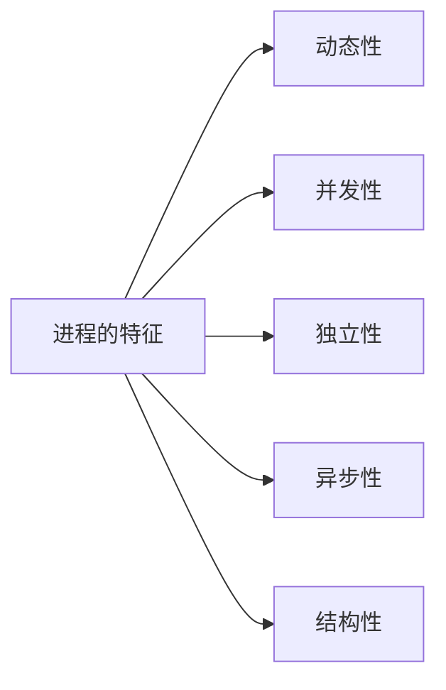

## 2. 进程的状态与转换、进程的组织
进程的状态：
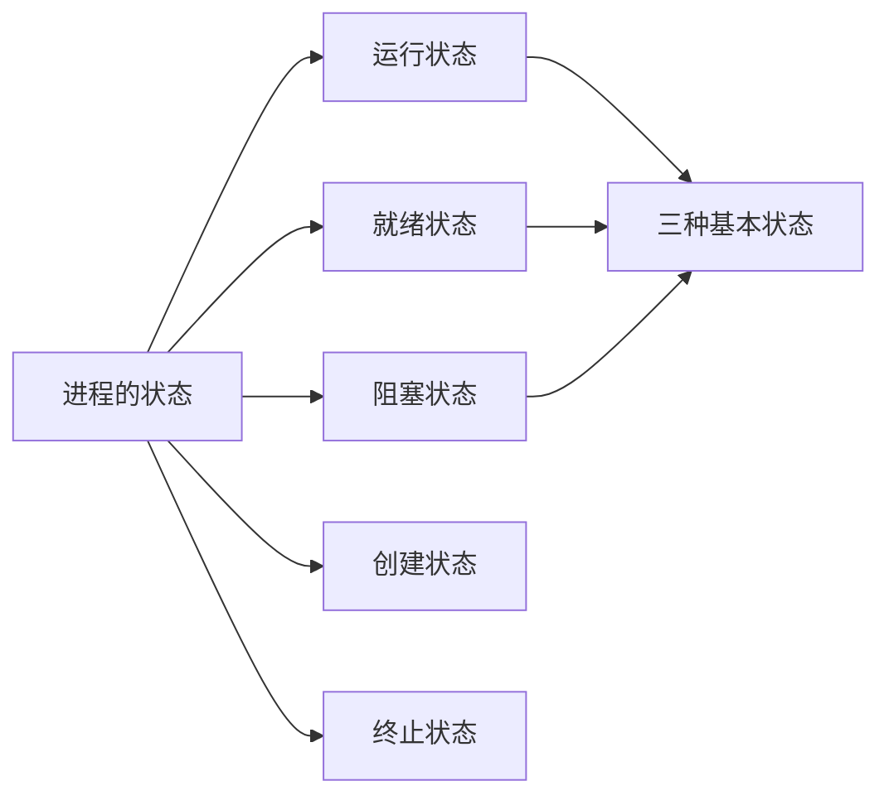

进程的状态变迁：

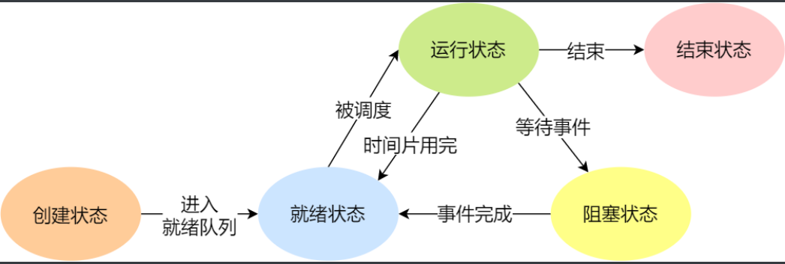

进程的组织：
- 链表方式
  - 按照进程状态将PCB分为多个队列
  - 操作系统持有指向各个队列的指针

  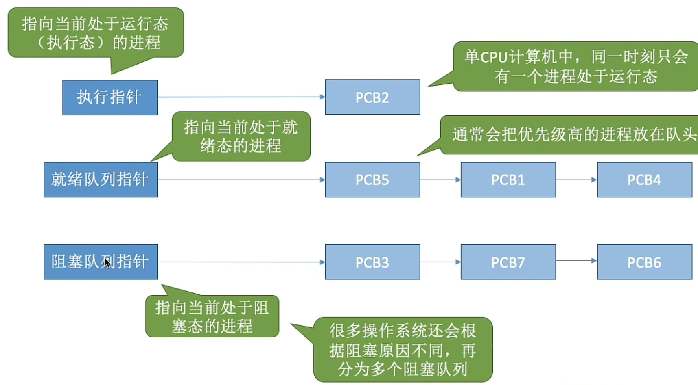
- 索引方式
  > 一般会选择链表方式

## 3. 进程控制
进程控制就是要实现<font color=FF0000>进程状态的转换</font>，由原语实现

相关原语：
- 进程的创建
- 进程的终止
- 进程的阻塞
- 进程的唤醒
- 进程的切换

无论哪个进程控制原语，要做的事都是：
- 更新PCB的信息
- 将PCB插入合适的队列（就绪队列、阻塞队列...）
- 分配/回收资源

## 4. 进程通信
- 共享存储（互斥共享方式）
  
  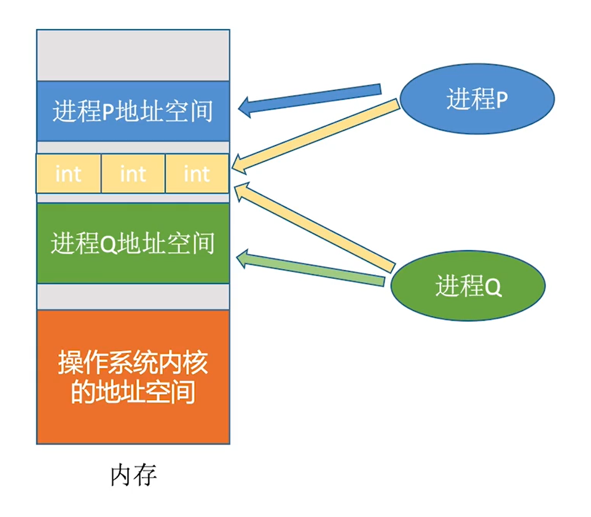
- 消息传递
  - 直接通信方式：消息直接挂到接受进程的消息队列里
  - 间接通信方式：消息先发到中间体
- 管道通信
  
  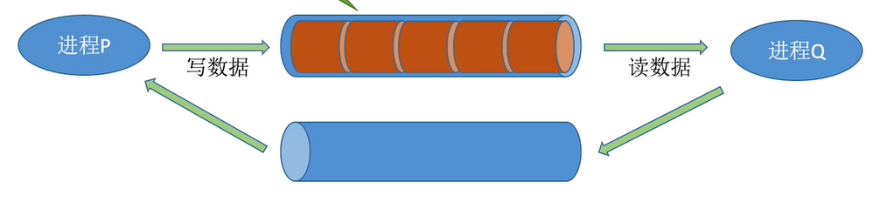
  - 管道：实际上就是一个内存缓冲区
  - 一个管道只能实现半双工通信，实现双向同时通信需要建立两个管道
  - 各进程互斥访问管道
  - 管道写满时，写进程堵塞；管道读空时，都进程阻塞

## 5. 线程
- 概念：线程是一个基本的CPU执行单位，也是<font color=FF0000>程序执行流的最小单位</font>。
  
  引入线程后，各线程间也能并发，提升了并发度。

- 线程与进程的最大区别：**线程时调度的基本单位，而进程则是资源拥有的基本单位**

- 线程的属性：
  - 线程是CPU调度的单位
  - 每个线程都有一个线程ID、线程控制块（TCB）
  - 线程也有就绪、阻塞、运行三种基本状态
  - 线程几乎不拥有系统资源
  - 同一进程的不同线程间共享进程的资源
  - 由于共享内存地址空间，同一进程中的线程间通信甚至无需系统干预同一进程中的线程切换，不会引起进程切换
  - 不同进程中的线程切换，会引起进程切换切换同进程内的线程，系统开销很小
  - 切换进程，系统开销较大

- 线程的实现方式
  - 用户线程（User Thread）：在用户空间实现的线程，不是由内核管理的线程，是由用户态的线程库来完成线程的管理；
  - 内核线程（Kernel Thread）：在内核中实现的线程，是由内核管理的线程；
  - 轻量级进程（LightWeight Process）：在内核中来支持用户线程；

- 多线程模型
  - 一对一模型
  
    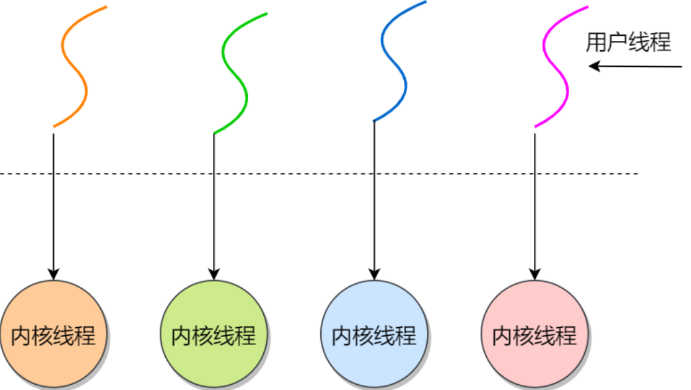
  - 多对一模型
    
    
  - 多对多模型

    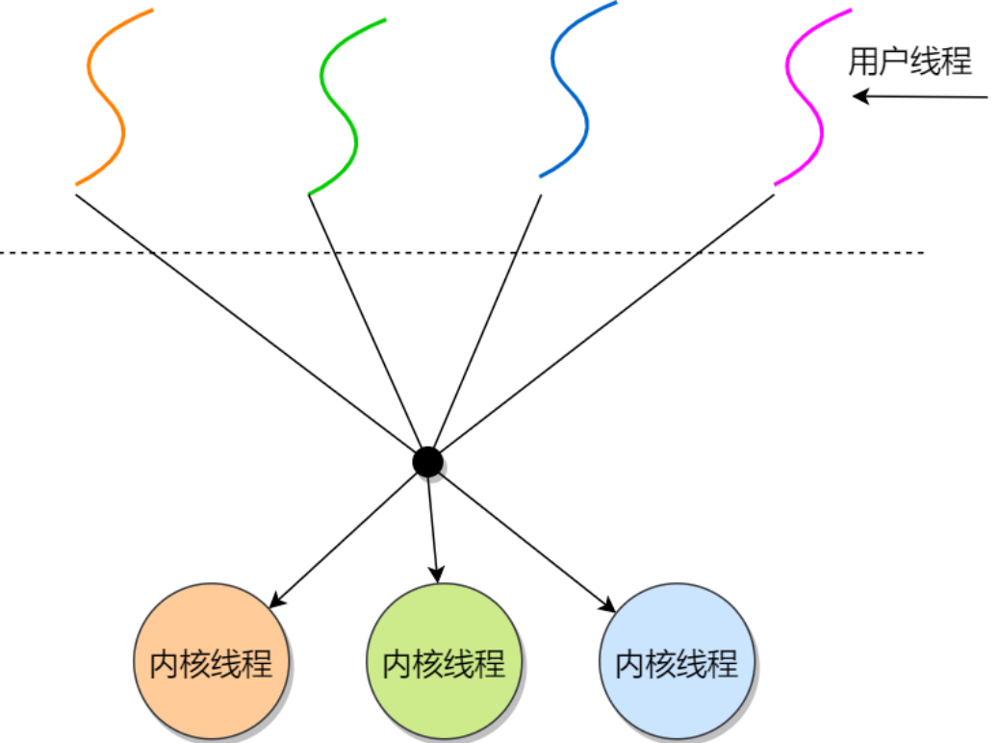

> 操作系统只看得见内核级线程，因此只有<font color=FF0000>内核级线程才是CPU分配的单位</font>

- 线程的状态与转换<font color=FF0000></font>
  - 运行状态：运行态/就绪态/阻塞态（同进程）
  - TCB（线程控制块）：如同每个进程有一个PCB一样，系统也为每个线程配置了一个线程控制块TCB, 将所有<font color=FF0000>用于控制和管理线程的信息</font>记录在TCB中。

    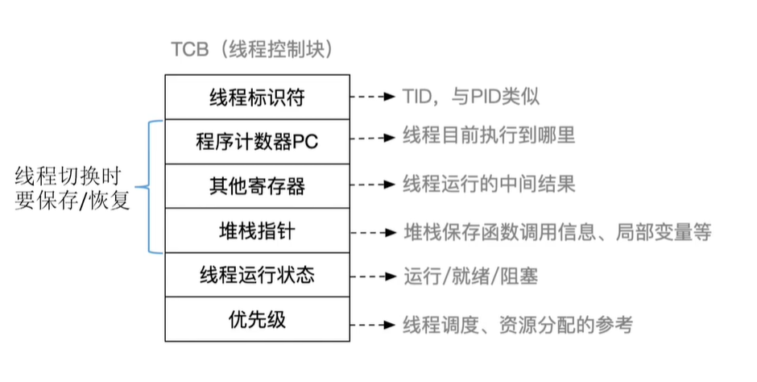

## 6. 调度
### 6.1 调度的基本概念
- 调度：按某种算法选择一个进程将处理机分配给它

- 七状态模型
  
  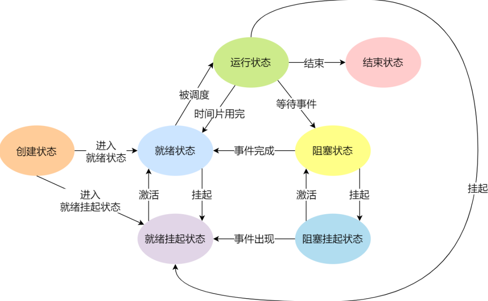
  - 阻塞挂起状态：进程在外存（硬盘）并等待某个事件的出现；
  - 就绪挂起状态：进程在外存（硬盘），但只要进入内存，即刻立刻运行；
  > 挂起与阻塞的区别：
  > - 挂起态是将进程映像调到外存去了
  > - 阻塞态下进程映像还在内存中
- 三层调度
  - 作业与进程的区别：
    - 作业：作业是用户提交给操作系统执行的一项任务或一组任务的集合，<font color=FF0000>通常由多个进程组成</font>
    - 进程：进程是计算机中正在运行的程序的实例，它是操作系统分配资源和调度执行的基本单位。

  ||要做什么|调度发生在...|发生频率|对进程状态的影响|
  |-|-|-|-|-|
  |高级调度(作业调度)|按照某种规则，从后备队列中选择合适的作业将其调入内存，并为其创建进程|外存->内存(面向作业)|最低|无->创建态->就绪态|
  |中级调度(内存调度)|按照某种规则，从挂起队列中选择合适的进程将其数据调回内存|外存->内存(面向进程)|中等|挂起态->就绪态|
  |低级调度(进程调度)|按照某种规则，从就绪队列中选择一个进程为其分配处理机|内存->CPU|最高|就绪态->运行态|

### 6.2 进程调度的时机、切换与过程、方式
- 进程调度时机：
  - 主动放弃
    - 进程正常终止
    - 发生异常种植
    - 主动阻塞（如 等待I/O）
  - 被动放弃
    - 分配给进程的时间片用完
    - 有更紧急的事需要处理
    - 优先级更高的进程进入就绪队列
- 不能进行进程调度的情况
  - 处理中断
  - 进程在操作系统内核程序临界区
  - 原子操作过程
- "狭义的进程调度"与"进程切换"的区别：
  - 狭义的进程调度 指从就绪队列中选出ige要运行的进程
  - 进程切换 指一个进程让出处理机，由另一个进程占用处理机的过程
- 进程调度的方式
  - 非抢占式：只能由<font color=FF0000>当前运行的进程</font>主动放弃CPU
  - 抢占式：可由<font color=FF0000>操作系统</font>剥夺当前进程的CPU使用权

### 6.3 调度器的闲逛进程
调度器/调度程序 决定：
- 调度算法（让谁运行）
- 时间片大小（运行时长）

调度时机：
- 创建新进程
- 进程退出
- 运行进程阻塞
- I/O中断发生

在<font color=FF0000>没有其他就绪进程</font>时，运行闲逛进程

### 6.4 调度算法的评价指标
- 利用率 = 忙碌时间/总时间
- 系统吞吐量 = 完成作业量/花费时间
- 周转时间 = 作业完成时间-作业提交时间
- 等待时间：进程/作业 等待杯服务的时间之和
- 响应时间：从用户提交请求到首次产生响应所用的时间
- 相应比 = (等待时间+要求服务时间) / 要求服务时间
  
## 7. 调度算法
> 饥饿：进程无法获得其所需的资源，一直处于等待状态，无法执行

|算法|思想&规则|进程调度方式|优缺点/特点|
|-|-|-|-|
|先来先服务(FCFS)|每次从就绪队列里面选择最先进入队列的进程，然后一直运行，直到进程退出或被阻塞，才会继续从队列中选择第一个进程接着运行|非抢占式|适合于CPU繁忙型作业的系统，而不适用于IO繁忙型作业的系统|
|最短作业优先(SJF)|优先选择运行时间最短的进程来运行|默认为非抢占式|可能会导致长作业无法运行|
|高响应比优先(HRRN)|每次进行进程调度的时候，先计算响应比优先级，然后把响应比优先级最高的进程投入运行|非抢占式|权衡了短作业和长作业|
|时间片轮转(RR)|每个进程被分配一个时间段，称为时间片，即允许该进程在时间段中运行|抢占式|时间片长度：太短导致过多进程上下文切换，开销大，降低CPU效率；太长对短作业进程的响应时间变成；一般设置在20ms~50ms|
|最高优先级调度(HPF)|从就绪队列中选择最高优先级的进程进行运行；优先级分为静态优先级和动态优先级|抢占式/非抢占式|可能会导致低优先级进程无法执行(饥饿)|
|多级反馈队列(MFQ)|设置多级就绪队列，各级队列优先级从高到低，时间片从小到大；新进程到达时先进入第1级队列，按FCFS原则排队等待被分配时间片，若用完时间片进程还未结束，则进程进入下一级队列队尾。如果此时已经是在最下级的队列，则重新放回该队列队尾；只有第k级队列为空时，才会为k＋1级队头的进程分配时间片|抢占式|很好的兼顾了长短作业，同时有较好的响应时间|

## 8. 同步、互斥、锁与信号量
### 8.1 同步与互斥
进程同步：并发进程/线程在⼀些关键点上需要互相等待与互通消息，这种相互制约的等待与互通信息称为进程/线程同步。


进程互斥：同一段时间内只能允许一个进程/线程访问该临界资源（在临界区执行）
- 对临界资源的互斥访问可以分为四个部分：
  - 进入区：检查是否可进入临界区，若可进入，需要"上锁"（设置正在访问临界资源的标志）
  - 临界区：访问临界资源的代码
  - 退出区：负责"解锁"（解除正在访问临界资源的标志）
  - 剩余区：其余代码部分
> 临界资源：一个时间段内只允许一个进程使用的资源

### 8.2 锁
自旋锁/忙等待锁：当获取不到锁时，线程就会采用while循环不断等待，直到锁可用；这种锁永远不会放弃cpu

无等待锁：当没获取到锁的时候，就把当前线程放入到锁的等待队列，然后执行调度程序，把 CPU 让给其他线程执行

### 8.3 信号量
信号量：是操作系统提供的⼀种协调共享资源访问的方法；通常信号量<font color=FF0000>表示资源的数量</font>，对应的变量是一个整型（sem）变量

控制信号量的原子操作：
- P 操作：将 sem 减 1，相减后，如果 sem < 0，则进程进入阻塞等待；如果sem>=0，表明还有资源可用，进程可正常继续执行；
- V 操作：将 sem 加 1，相加后，如果 sem <= 0 ，唤醒⼀个等待中的进程；如果sem>0，表明当前没有阻塞中的进程；
- P操作用于进入临界区之前，V操作用于离开临界区之后；两个操作必须成对出现

```C
// 信号量数据结构
type struct sem_t{ 
    int sem;   // 资源个数
    queue_t *q;// 等待队列
} sem_t;

// 初始化信号量
void init(sem_t *s, int sem) {
    s->sem = sem;
    queue_init(s->q); 
}

// P操作
void P(sem_t *s) {
    s->sem--;
    if(s->sem < 0) { //表明该类资源已经分配完毕
        1．保留调用线程 CPU 现场；
        2．将该线程的 TCB 插入到 s 的等待队列；
        3．设置该线程为等待状态；
        4．执行调度程序；
    }
}

// V操作
void V(sem_t *s) {
    s->sem++;
    if(s->sem <= 0) { //表明依然有进程在等待该类资源
        1．移出 s 等待队列首元素；
        2．将该线程的 TCB 插入就绪队列；
        3．设置该线程为「就绪」状态；
    }
} 
```
### 8.4 使用信号量实现临界区的互斥访问：
- 设置⼀个互斥信号量，其初值为1，表示该临界资源未被占用
- 临界区之前对信号量执行P操作
- 临界区之后对信号量执行V操作
  
  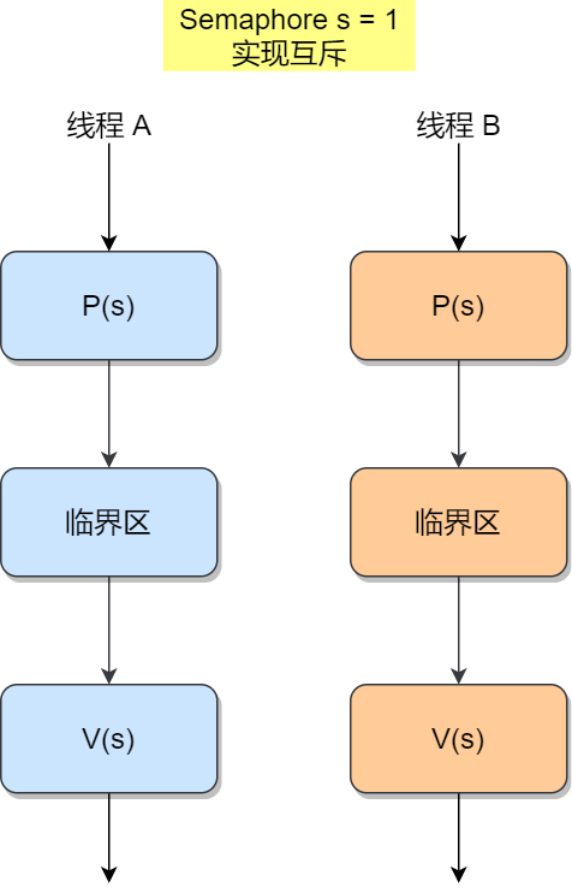
```C
mutex = 1; //初始化互斥信号量

T1() {
  ...
  P(mutex); //使用临界资源后需要加锁
  临界区代码段
  V(mutex); //使用临界资源后需要解锁
  ...
}

T2() {
  ...
  P(mutex); //使用临界资源后需要加锁
  临界区代码段
  V(mutex); //使用临界资源后需要解锁
  ...
}
```
对于两个并发线程，互斥信号量取值及对应情况：
|互斥信号量的值|线程情况|
|-|-|
|1|没有线程进入临界区|
|0|有一个线程进入临界区|
|-1|一个线程进入临界区，另一个线程等待进入|

通过互斥信号量的方式，就能保证临界区任何时刻只有⼀个线程在执行，就达到了互斥的效果。


### 8.5 使用信号量实现事件同步
- 设置⼀个同步信号量，其初值为0，表示刚开始没有这种资源
- 在"前操作"之后执行V操作
- 在"后操作"之前执行P操作

例：T2的"代码4"要基于T1的"代码2"的运行结果才能执行，即"代码4"一定是在"代码2"之后才会执行
```C
S = 0; //初始化同步信号量

T1() {
  代码1;
  代码2;
  V(S); //释放资源
  代码3;
}

T2() {
  P(S);
  代码4;
  代码5;
  代码6;
}
```
先执行V与先执行P的情况：
|操作|情况|
|-|-|
|先执行到V(S)操作|释放资源；之后当执行到P(S)操作时，由于S=1，表示有可用资源，P2进程不会执行block原语，而是继续往下执行代码4|
|先执行到P(S)操作|S=-1，表示此时没有可用资源，因此P操作中会执行block原语；当执行完代码2，继而执行V(S)操作，S=0，由于此时有进程在该信号量对应的阻塞队列中，因此会在V操作中唤醒P2进程。这样P2就可以继续执行代码4了|

## 9. 并发编程中的经典同步问题
### 9.1 生产者消费者问题
生产者-消费者问题描述：
- 生产者在生成数据后，放在⼀个缓冲区中；
- 消费者从缓冲区取出数据处理；
- 任何时刻，只能有⼀个生产者或消费者可以访问缓冲区；

分析：
- 该问题中各进程需要<font color=FF0000>互斥</font>
- 缓冲区空的时候，消费者必须等待生产者生成数据，缓冲区满时候，生产者必须等待消费者取出数据，说明生产者与消费者需要<font color=FF0000>同步</font>

```C++
#define N 100
semaphore mutex = 1;       // 互斥信号量，用于临界区的互斥访问
semaphore emptyBuffers = N;// 同步信号量，表示缓冲区「空槽」的个数
semaphore fullBuffers = 0; // 同步信号量，表示缓冲区「满槽」的个数

// 生产者线程函数
producer() {
    while(TRUE) {
        P(emptyBuffers);// 将空槽的个数—1
        P(mutex);// 进入临界区 
        将生成的数据放到缓冲区中；
        V(mutex);// 离开临界区 
        V(fullBuffers );// 将满槽的个数＋1中
    }
}

// 消费者线程函数 
consumer() {
    while(TRUE) {
        P(fullBuffers);// 将满槽的个数—1
        P(mutex);// 进入临界区 
        从缓冲区里读取数据；
        V(mutex);// 离开临界区
        V(emptyBuffers);// 将空槽的个数＋1
    }
} 
```

### 9.2 读者写者问题
读者-写者的问题描述：
- 「读-读」允许：同⼀时刻，允许多个读者同时读
- 「读-写」互斥：没有写者时读者才能读，没有读者时写者才能写
- 「写-写」互斥：没有其他写者时，写者才能写

分析：
- 读者、写者优先级相同；
- 读者、写者互斥访问；
- 只能一个写者访问临界区；
- 可以有多个读者同时访问临界资源（用计数器count记录正在访问共享文件的读进程数）；

```C++
semahphore rw = 1;   // 用于实现对共享文件的互斥访问
semaphore cmutex = 1;// 用于保证对count变量的互斥访问 
semaphore w = 1;     // 用于控制写者写操作的互斥信号量
int count = 0;       // 记录当前有几个读进程在访问文件

//写者进程函数
writer() {
    while(1) {
        P(rw);
        P(w); //写操作互斥
        写文件
        V(w); //离开临界区
        V(rw);
    }
}

//读者进程函数
reader() {
    while(1) {
        P(rw);
        P(cmutex);
        if(count==0)
            P(w);  //当第一个读者进入，如果有写者则阻塞写者写操作
        count++;
        V(cmutex);
        V(rw);
        读文件
        P(cmutex);
        count--;
        if (count == 0)
            V(w);  //当没有读者了，则唤醒阻塞中写者的写操作
        V(cmutex);
    }
}
```
### 9.3 哲学家进餐问题
哲学家就餐的问题描述：
- 5个哲学家，围绕着一张圆桌吃面；
- 这个桌子只有5支筷子，每两个哲学家之间放一支筷子；
- 哲学家围在一起先思考，思考中途饿了就会想进餐；
- 每个哲学家需要拿到左右两边的筷子才进餐；
- 吃完后，会把两支筷子放回原处，继续思考；


分析：
- 互斥信号量的作用：只要有⼀个哲学家进入了「临界区」，也就是准备要拿叉子时，其他哲学家都不能动，只有这位哲学家用完叉子了，才能轮到下⼀个哲学家进餐
- 更准确的说法应该是：各哲学家拿筷子这件事必须<font color=FF0000>互斥</font>的执行。
  
  这就保证了<font color=FF0000>即使一个哲学家在拿筷子拿到一半时被阻塞，也不会有别的哲学家会继续尝试拿筷子</font>。
  
  这样的话，<font color=FF0000>当前正在吃饭的哲学家放下筷子后，被阻塞的哲学家就可以获得等待的筷子了</font>。

```C++
semaphore chopstick[5]={1,1,1,1,1}; 
semaphore mutex = 1;// 互斥地取筷子 
Pi (){ // i号哲学家的进程
    while(1){
        P(mutex);
        P(chopstick[i]);       // 拿左 
        P(chopstick[(i+1)%5]); // 拿右 
        V(mutex);
        吃饭...
        V(chopstick[i]);       // 放左 
        V(chopstick[(i+1)%5]); // 放右 
        思考...
    }
} 
```

## 10 死锁
死锁的概念：各进程互相等待对方手里的资源，导致各进程都阻塞，无法向前推进的现象。

> 用通俗的语言解释死锁：
> 
> 一个桌子旁坐了两个人A和B，桌面上只有一对刀叉，但每个人必须同时拿起刀叉才能进食；
> 
> 此时A手里拿着刀，B手里拿着叉子，为了进食，A和B都不想放弃自己手里的餐具同时又想要对方手里的餐具；
> 
> 此时两个人都处于想吃却吃不了的状态，即<font color=FF0000>各进程阻塞，死锁发生</font>。

死锁只有<font color=FF0000>同时满足</font>以下四个条件才会发生：
- 互斥条件：多个线程不能同时使用同⼀个资源
  
  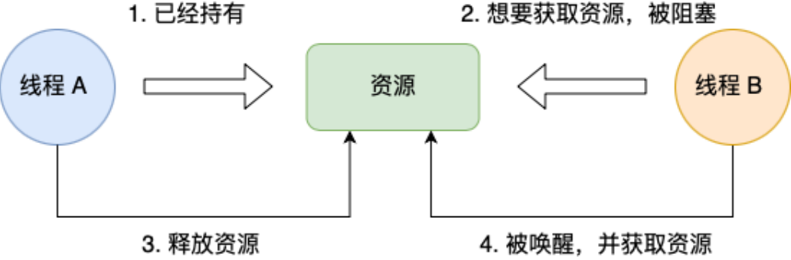
- 不剥夺条件：进程所获得的资源在未使用完之前，不能由其他进程强行夺走，只能主动释放
  
  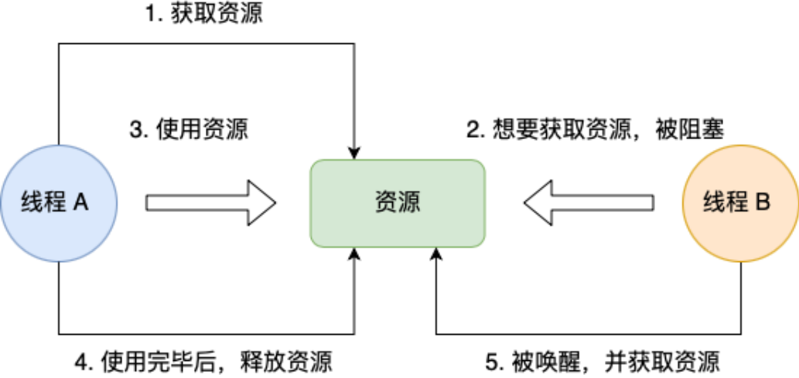
- 持有并等待条件：当线程A已经持有了资源1，又想申请资源2，但是不释放资源1；

  线程B持有资源2，想申请资源1，但是不释放资源2，导致死锁
   
  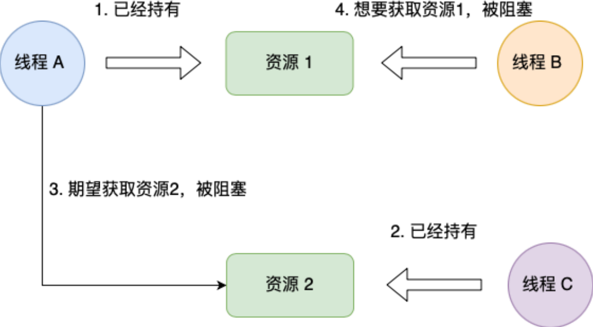
- 环路等待条件：几个线程的获取资源顺序构成了环形等待链
  
  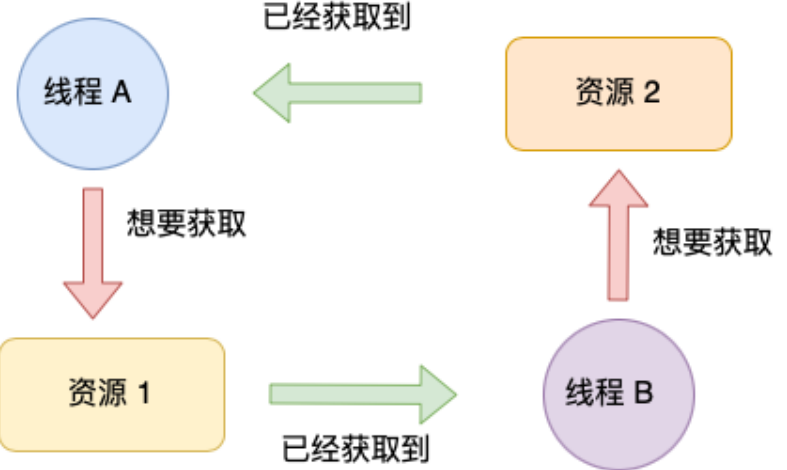

预防/避免死锁：<font color=FF0000></font>
- 破坏死锁四个条件的一个条件即可；最常见的并且可行的就是<font color=FF0000>使用资源有序分配法，来破坏环路等待条件</font>。
  - 资源有序分配法：给系统中的资源编号，规定每个进程必须按编号递增的顺序请求资源。（即<font color=FF0000>保证上锁的顺序⼀致</font>）
