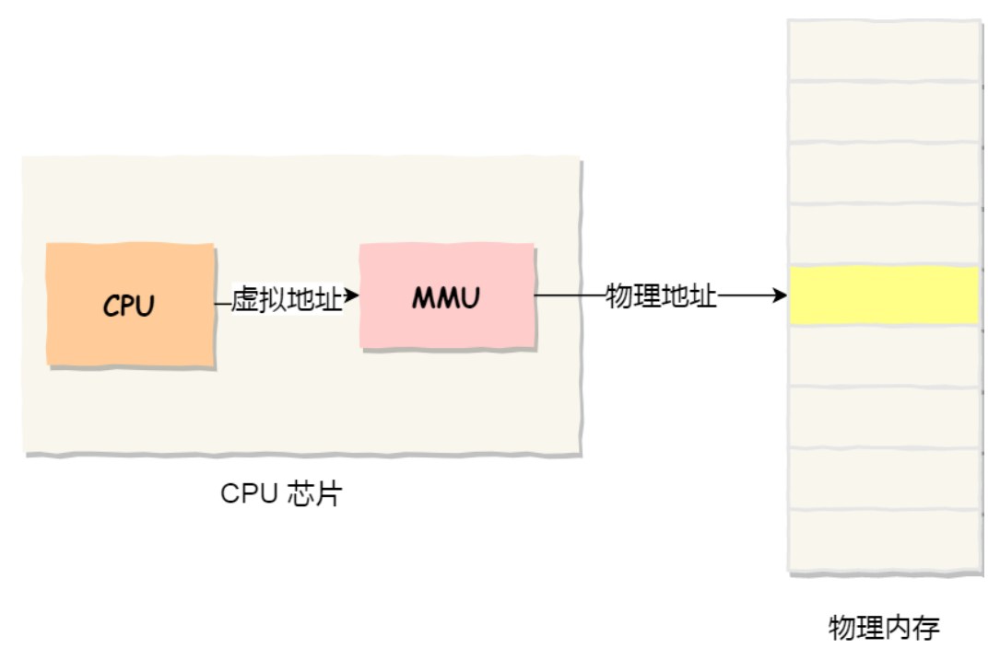
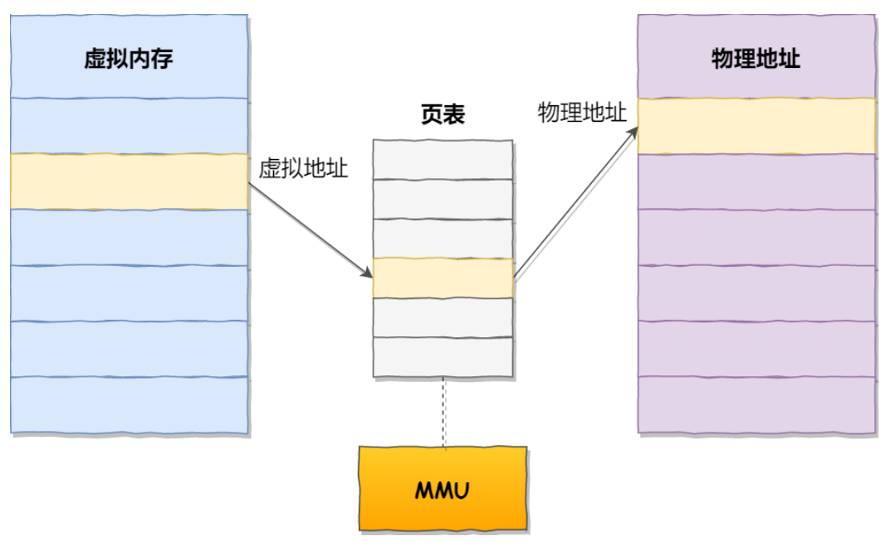
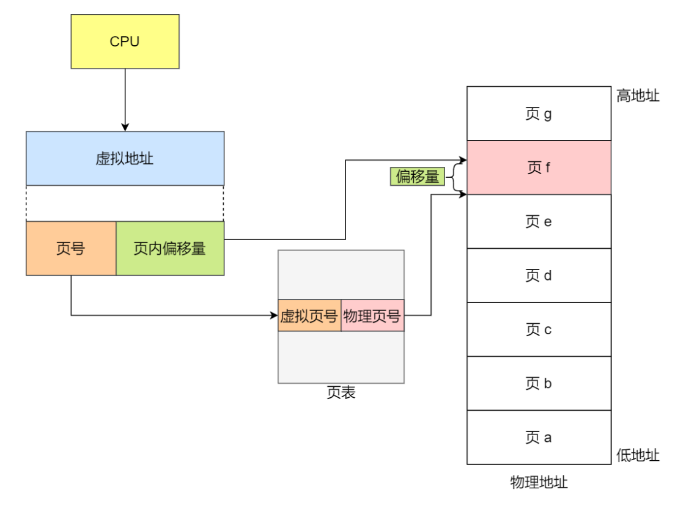
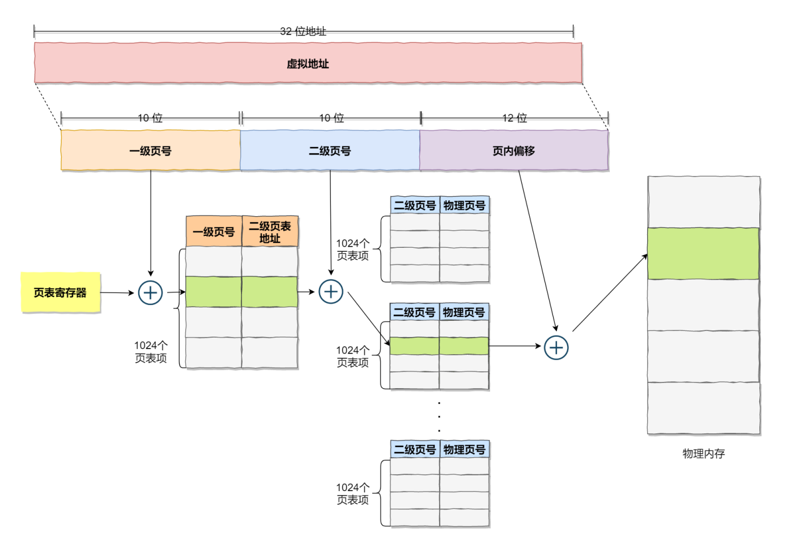
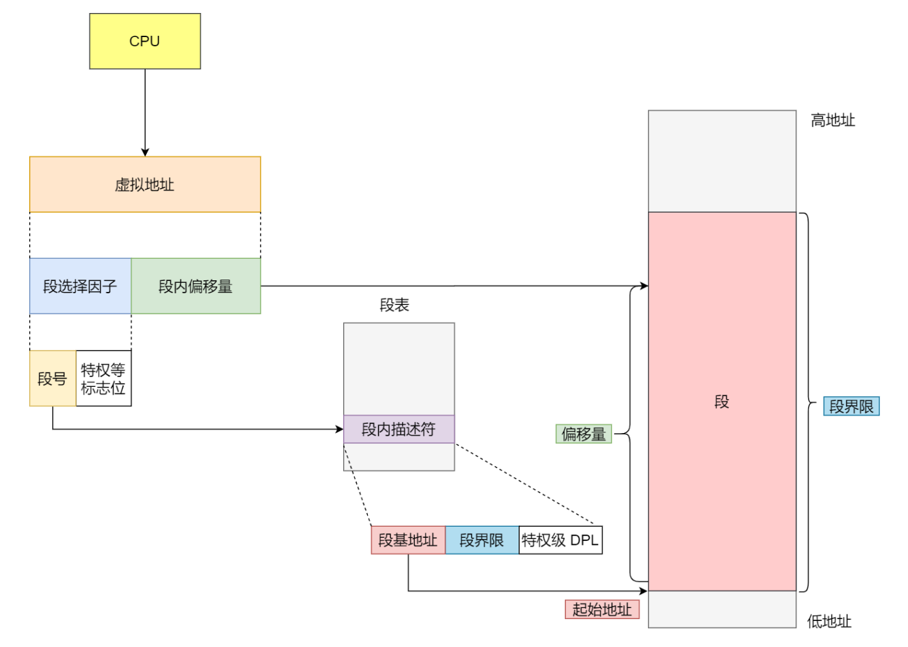
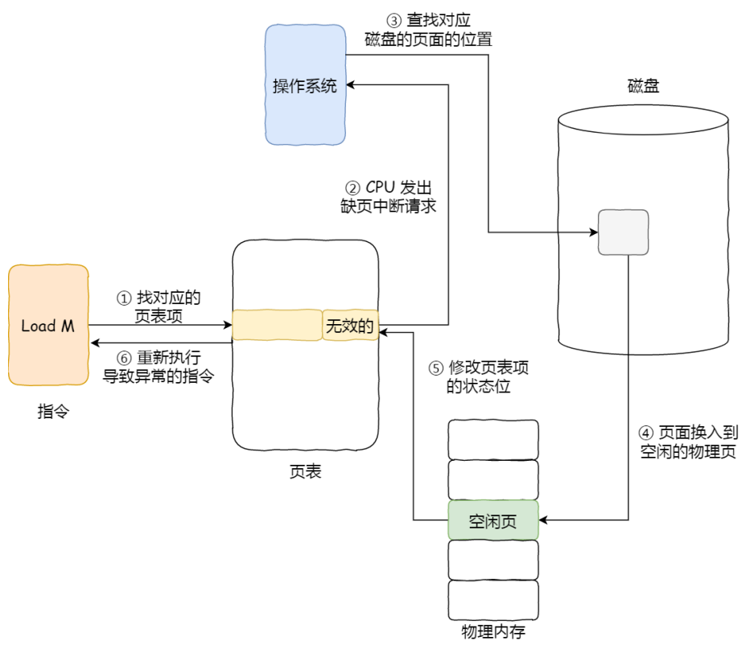

# 三、内存
## 1. 内存的概念
内存的作用：程序执行前需要先放到内存中才能被CPU处理

## 2. 虚拟内存和物理内存
操作系统会提供⼀种机制，将不同进程的虚拟地址和不同内存的物理地址映射起来
- 虚拟内存地址：程序实际使用的内存地址
- 物理内存地址：实际存在硬件内的空间地址

操作系统引入了虚拟内存，进程持有的虚拟地址会通过 CPU 芯片中的内存管理单元（MMU）的映射关系，来转换变成物理地址，然后再通过物理地址访问内存：

内存管理的两种方法：
- 内存分段
- 内存分页

### 2.1 内存分页
分页：把整个虚拟和物理内存空间切成⼀段段固定尺寸的大小，即"页"。页通过页号和页内偏移量来表示

虚拟地址与物理地址之间通过页表来映射：

分页管理中内存地址转换步骤：
- 把虚拟内存地址，切分成页号和偏移量；
  - 页号 = 逻辑地址 / 页面长度
  - 偏移量 = 逻辑地址 % 页面长度
- 根据页号在页表中查询对应的物理页号
- 把 物理页号 加上 偏移量，得到物理内存地址
  
  

简单页表缺点：空间缺陷；操作系统可以运行非常多的进程。每一个进程都需要页表，那么最后这个页表就会过于庞大

空间缺陷解决方法：多级页表

### 2.2 TLB(快表)
CPU里有一个专门存放最长访问的页表项的Cache，即TLB

有了 TLB 后，那么 CPU 在寻址时，会先查 TLB，如果没找到，才会继续查常规的页表。

### 2.3 多级页表
通过给页表分级，形成多级页表，解决普通页表空间缺陷的问题。

由于页表项大小为4B，页面大小为4KB，每个二级页表可以存放4K/4=1K=1024个页表项

优点：因为操作系统的物理内存往往是不会全部被使用完，所以多级页表会比单纯的内存分页效果更好

### 2.4 内存分段
分段：把虚拟地址空间中的虚拟内存组织成一些长度可变的称为段的内存块单元

分段系统的虚拟地址由 段号 和 段内偏移量 组成
- 段号：段表的索引，通过在段表中查询段号可以获得段的基地址、段长（段界限）、特权等级
- 段内偏移量：段内偏移量应该位于 0 和段界限之间，如果段内偏移量是合法的，就将段基地址加上段内偏移量得到物理内存地址。

虚拟地址通过段表与物理地址进行映射

内存分段的缺点：
- 会产生内存碎片
- 内存交换率低

### 2.5 段页式内存管理
段页式内存管理实现的方式：
- 先将程序划分为多个有逻辑意义的段，也就是前面提到的分段机制；
- 接着再把每个段划分为多个页，也就是对分段划分出来的连续空间，再划分固定大小的页。

段页式内存管理的地址结构：
- 段号
- 段内页号
- 页内位移

段页式地址变换中要得到物理地址须经过三次内存访问：
1. 访问段表，得到页表起始地址；
2. 访问页表，得到物理页号；
3. 将物理页号与页内位移组合，得到物理地址。

## 3. 内存页面置换算法
缺页中断/缺页异常：当 CPU 访问的页面不在物理内存时，便会产⽣⼀个缺页中断，请求操作系统将所缺页调入到物理内存

内存页面置换算法功能：当出现缺页异常，且需调入新页面而内存已满时，选择被置换的物理页面

|算法|思想&规则|优缺点|
|-|-|-|
|最佳置换算法(OPT)|置换在未来最长时间不访问的页面|缺页率小，但无法实现|
|先进先出置换算法(FIFO)|置换最早进入内存的页面；使用一个队列记录调入内存的顺序，每次置换队头页面|实现简单，但性能差|
|最近最久未使用置换算法(LRU)|置换最久未使用的页面；用访问字段记录上次访问时间t，置换t最大的页面|性能好，但需要硬件支持，开销大|
|时钟置换算法(CLOCK)|将所有页面保存在一个环形链表中；当访问位是0，置换页面；若访问位是1，将其置0，继续移动表针进行检查|实现简单，开销小|
|最不常用算法(LFU)|置换"访问次数"最少的页面；对所有页面设置访问计数器，每访问一次计数器+1，置换计数器最小的页面|实现简单，效率低|