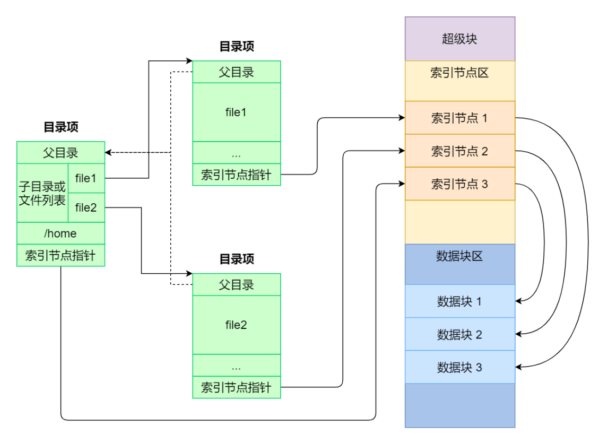
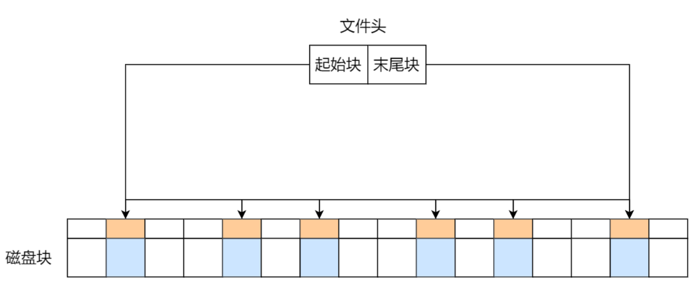
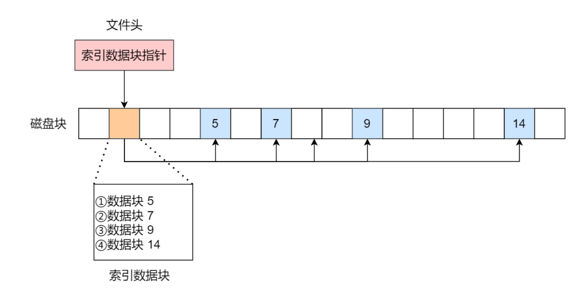
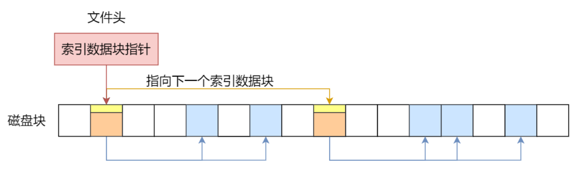
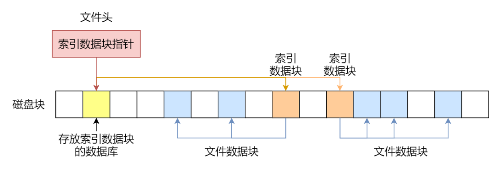
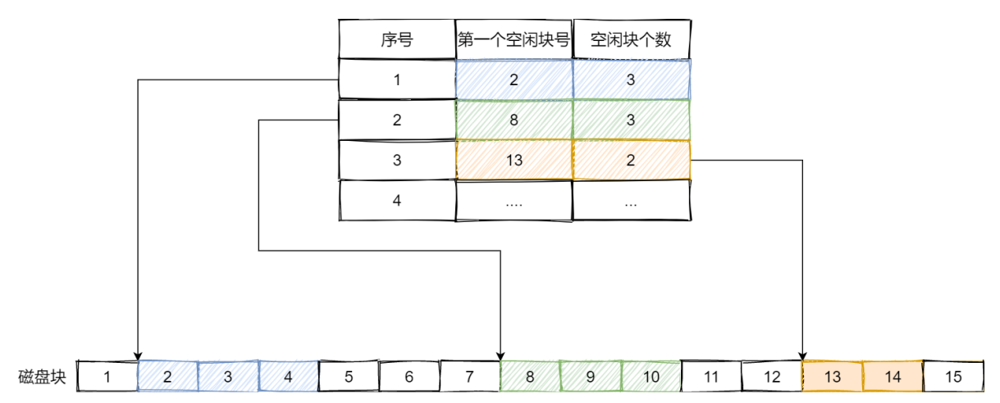
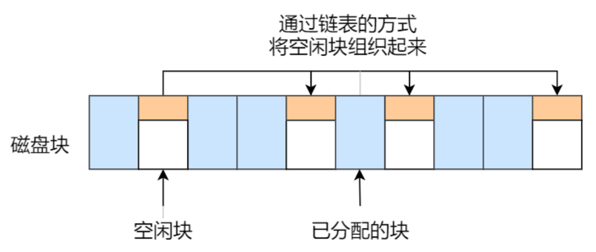
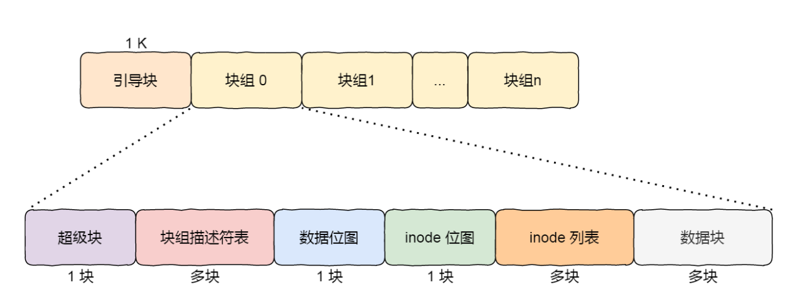
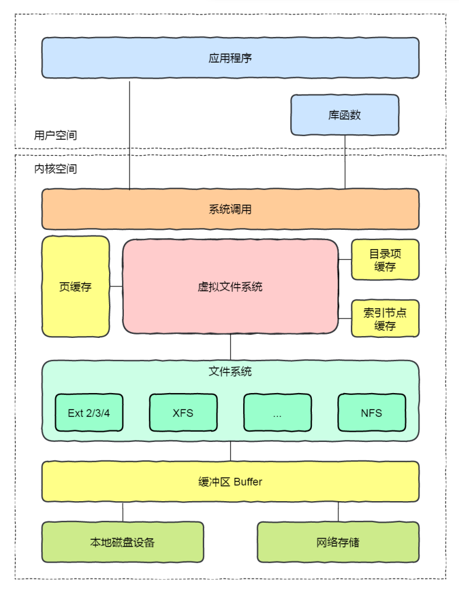

# 四、文件系统
## 1. 文件系统的基本组成
Linux文件系统会为每个文件分配两个数据结构
- 索引节点(inode)：记录文件的元信息，包括inode编号、文件大小、访问权限、创建时间，修改时间、磁盘位置。inode是文件的<font color="FF0000">唯一</font>标识，存放在硬盘中
- 目录项：记录文件名、索引节点指针与其他目录项的层级关系，缓存在内存中

索引节点、目录录项以及文件数据的关系：



磁盘格式化的时候为三个储存区域：
- 超级块：储存文件系统的详细信息
- 索引节点区：储存索引节点
- 数据块区：储存文件或目录数据

加载到内存的时机
- 超级块：当文件系统挂载到内存时候
- 索引节点区：当文件被访问时

## 2. 文件的使用
通过系统调用来打开文件：
- 用`open`系统调用打开文件
- 用`write`写数据
- 用`close`系统调用关闭文件

```C++
fd = open(name, flag);  //打开文件；fd是文件描述符
...
write(fd, ...);         //写数据
...
close(fd);              //关闭文件
```

文件打开后，os为每个进程维护一个打开文件表，维护着打开文件的状态和信息：
> 文件描述符实际上就是一种索引；根据文件描述符能找到打开文件表中对应文件的信息
- 文件指针
- 文件打开计数器
- 文件磁盘位置
- 访问权限(创建、制度、读写、添加)

文件系统的操作基本单位是<font color="FF0000">数据块</font>

## 3. 文件的存储
连续空间存放：文件存放在磁盘连续的物理空间中
- 缺点：容易产生磁盘空间碎片；文件长度不易扩展

非连续空间存放
- 链表方式
  - 隐式链表
    - 实现：文件头包含起始块和末尾块的位置；每个数据块留出指针空间，用来存放下一个数据块的位置
    
      
    - 优点：消除磁盘碎片
    - 缺点：无法直接访问数据块；如果链表指针丢失，会导致文件数据丢失
  - 显式链表
    - 改进：把用于链接文件各数据块的指针，显式地存放在内存的一张链接表中；每个表项中存放链接指针
    - 优点：提高检索速度，减少访问磁盘速度
    - 缺点：不适用于大磁盘
- 索引方式
  - 实现：为每个文件创建索引数据块，存放指向文件数据块的指针列表; 文件头需要包含指向 索引数据块 的指针

    
  - 优点：
    - 文件的创建、增大、缩小方便
    - 不会有碎片问题
    - 支持顺序读写和随机读写
  - 缺点：
    - 由于存储索引导致开销大
    - 无法处理大文件的存放
- 链式索引块
  - 实现：在索引数据块流出一个存放下一个索引数据块的指针
  
    
    - 优点：解决索引方式无法处理大文件存放的问题（当一个索引数据块的索引信息用完了，就可以通过指针的方式，找到下一个索引数据块的信息）
    - 缺点：如果链表指针丢失，会导致文件数据丢失
- 多级索引块
  - 实现：通过一个索引块来存放多个索引数据块
  
     

## 4. 文件存储空间管理
空闲表法：为所有空闲空间建立一张空闲表，每个表项是空闲区的第一个块号 和 空闲区的块个数


空闲链表法：通过链表的方式管理空闲空间，每一个空闲块有一个指针指向下一个空闲块


> 空闲表法和空闲链表法都不适合用于大型文件系统

位图法：利用二进制的一位来表示一个磁盘中一个盘块的使用情况；0表示空闲，1表示已分配

> linux使用位图法来管理空闲空间

## 5. 文件系统的结构
在Linux文件系统，有N多的块组，就能够表示N大的文件。



块组包含：
- 超级块：包含文件系统重要信息，图inode总数、块总数
- 块组描述符：包含文件系统中各个块组状态，如块组中空闲块和inode数目
- 数据位图和inode位图：表示数据块和inode的状态
- inode列表：包含块组中所有inode
- 数据块：包含文件的有用信息

目录也是一个特殊的块，普通的块保存的是文件数据，目录的块保存着文件信息，方式是<font color=FF0000>哈希表</font>

## 6. 文件共享
软连接：重新创建一个文件，它有独立的inode，但是它的文件内容是另外一个文件的路径，软连接是可以跨越文件系统的，有时候目标文件被删除，链接文件还在

硬连接：多个目录项中的索引节点指向同一个文件，指向同一个inode，所以其不可以跨文件系统，只有删除文件的所有硬链接以及源文件的时候，系统才会彻底删除该文件

## 7. 虚拟文件系统
虚拟文件系统：向上层用户进程提供统一标准的系统调用接口，<font color="FF0000">屏蔽底层具体文件系统的实现差异</font>

在 Linux ⽂件系统中用户空间、系统调用、虚拟机文件系统、缓存、文件系统以及存储之间的关系如下图：



Linux支持的文件系统：
- 磁盘的文件系统
- 内存的文件系统
- 网络的文件系统

文件系统挂载：文件系统首先要先挂载到某个目录才可以正常使用，比如 Linux 系统在启动时，会把文件系统挂载到根目录。

## 8. 文件I/O
### 8.1 缓冲与非缓冲I/O
判断依据：是否利用标准库缓冲

- 缓冲IO：利用标准库缓存实现文件加速访问，标准库再通过系统调用访问文件
- 非缓冲IO：直接通过系统调用访问文件，不经过标准库缓存

### 8.2 直接与非直接I/O
判断依据：是否利用操作系统缓冲

- 直接IO：不发生内核缓存和用户程序之间的数据复制，直接经过文件系统访问磁盘
- 非直接IO，读的时候数据从内核缓存拷贝给用户程序，写的时候数据从用户程序拷给内核缓存，再由内核决定什么时候写入数据到磁盘

### 8.3 阻塞与非阻塞 I/O
> 阻塞与非阻塞 I/O都属于同步I/O
- 阻塞I/O：当用户执行 read ，线程会被阻塞，⼀直等到内核数据准备好，并把数据从内核缓冲区拷贝到应用程序的缓冲区中，当拷贝过程完成， read 才会返回。
  
  
- 非阻塞I/O：非阻塞的 read 请求在数据未准备好的情况下立即返回，可以继续往下执行，此时应用程序不断轮询内核，直到数据准备好，内核将数据拷贝到应用程序缓冲区， read 调用
才可以获取到结果。

  

### 8.4 同步与异步 I/O
- 基于非阻塞I/O的多路复用(同步调用)：通过I/O时间分发，当内核数据准备好时，再以事件通知应用程序进行操作

  
- 异步I/O(aio_read)：发起一次aio_read系统调用后就返回，内核自动将数据从内核空间拷贝到应用程序空间，<font color=FF0000>应用程序不主动发起拷贝操作</font>
  
  

## 9. 磁盘调度算法
磁盘调度算法的目的：通过优化磁盘的访问请求顺序来提高磁盘的访问性能

|算法|思想&规则|优点|缺点|
|-|-|-|-|
|先来先服务(FCFS)|根据进程请求访问磁盘的先后顺序进行调度|公平|如果大量进程竞争使用磁盘，请求访问的磁道可能会很分散，那先来先服务算法在性能上就会显得很差|
|最短寻找时间优先(SSTF)|优先选择从当前磁头位置所需寻道时间最短的请求|性能好，平均寻道时间段|磁头有可能在⼀个小区域内来回移动，产生饥饿|
|扫描算法(SCAN)|它规定磁头在一个方向上移动，访问所有未完成的请求，直到磁头到达该方向上的最后的磁道，才调换方向，解决SSTF饥饿的问题|性能好，不会饥饿|这种方法会导致中间部分比较占便宜，访问频率比较高，两边会比较吃亏|
|循环扫描算法(C-SCAN)|只有磁头朝着某个方向特定移动的时候，才处理磁道访问的请求，而复位磁头返回中途是不处理任何请求的|相比SCAN，响应相对比较平均|相比SCAN，平均寻道时间更长|
|C-LOOK算法|C-SCAN的改进算法，当磁头移动方向向上不再有请求，立即让磁头返回|相比C-SCAN不需要每次移动到最外侧，缩短寻道时间||