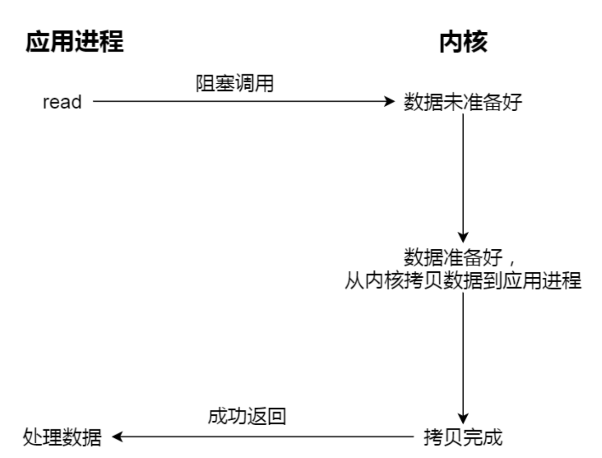
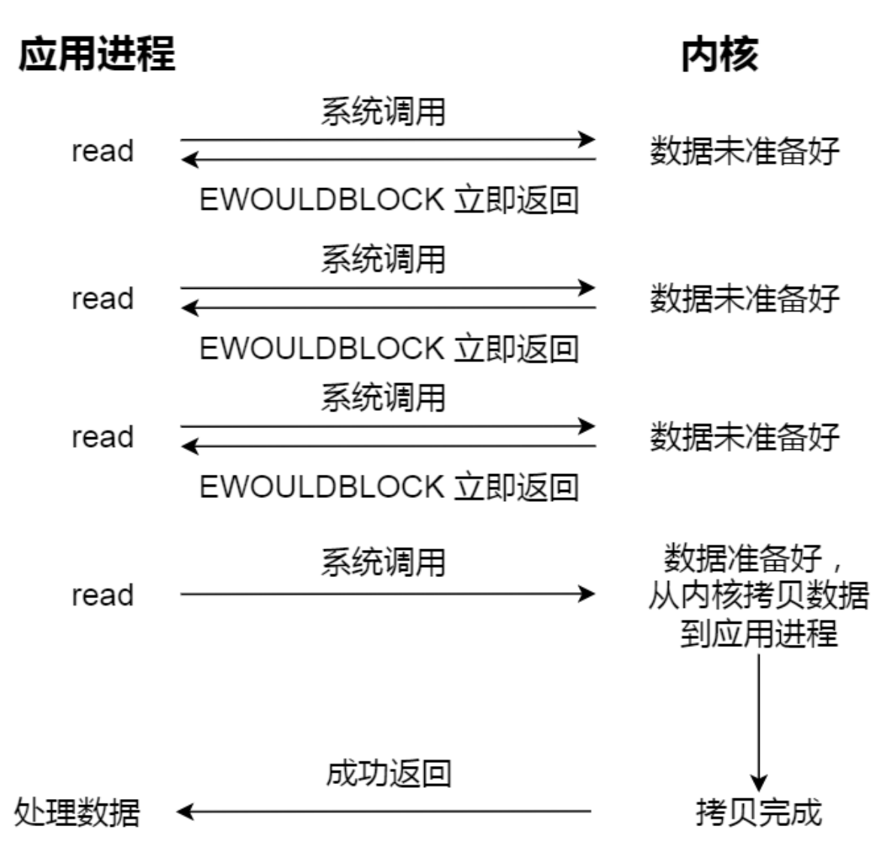
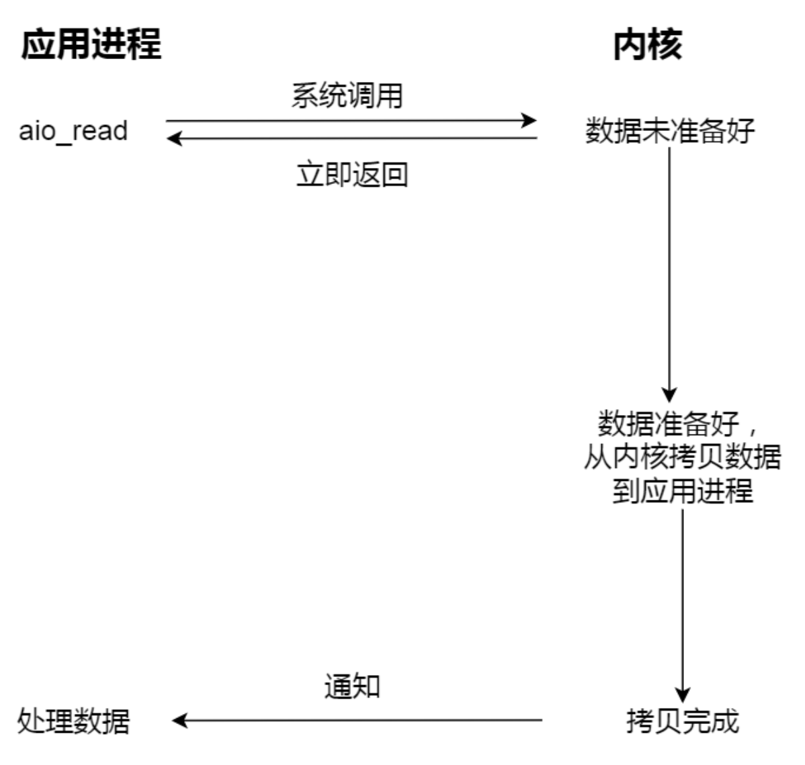

## 8. 文件I/O
### 8.1 缓冲与非缓冲I/O
判断依据：是否利用标准库缓冲

- 缓冲IO：利用标准库缓存实现文件加速访问，标准库再通过系统调用访问文件
- 非缓冲IO：直接通过系统调用访问文件，不经过标准库缓存

### 8.2 直接与非直接I/O
判断依据：是否利用操作系统缓冲

- 直接IO：不发生内核缓存和用户程序之间的数据复制，直接经过文件系统访问磁盘
- 非直接IO，读的时候数据从内核缓存拷贝给用户程序，写的时候数据从用户程序拷给内核缓存，再由内核决定什么时候写入数据到磁盘

### 8.3 阻塞与非阻塞 I/O
> 阻塞与非阻塞 I/O都属于同步I/O
- 阻塞I/O：当用户执⾏ read ，线程会被阻塞，⼀直等到内核数据准备好，并把数据从内核缓冲区拷贝到应用程序的缓冲区中，当拷贝过程完成， read 才会返回。
  
  
- 非阻塞I/O：⾮阻塞的 read 请求在数据未准备好的情况下⽴即返回，可以继续往下执⾏，此时应用程序不断轮询内核，直到数据准备好，内核将数据拷⻉到应用程序缓冲区， read 调用
才可以获取到结果。

  

### 8.4 同步与异步 I/O
- 基于非阻塞I/O的多路复用(同步调用)：通过I/O时间分发，当内核数据准备好时，再以事件通知应用程序进行操作

  
- 异步I/O(aio_read)：发起一次aio_read系统调用后就返回，内核自动将数据从内核空间拷贝到应用程序空间，应用程序不主动发起拷贝操作
  
  

## 9. 磁盘调度算法
磁盘调度算法的目的：通过优化磁盘的访问请求顺序来提高磁盘的访问性能

|算法|思想&规则|优点|缺点|
|-|-|-|-|
|先来先服务(FCFS)|根据进程请求访问磁盘的先后顺序进行调度|公平|如果⼤量进程竞争使用磁盘，请求访问的磁道可能会很分散，那先来先服务算法在性能上就会显得很差|
|最短寻找时间优先(SSTF)|优先选择从当前磁头位置所需寻道时间最短的请求|性能好，平均寻道时间段|磁头有可能在⼀个小区域内来回移动，产生饥饿|
|扫描算法(SCAN)|它规定磁头在一个方向上移动，访问所有未完成的请求，直到磁头到达该方向上的最后的磁道，才调换方向，解决SSTF饥饿的问题|性能好，不会饥饿|这种方法会导致中间部分比较占便宜，访问频率比较高，两边会比较吃亏|
|循环扫描算法(C-SCAN)|只有磁头朝着某个方向特定移动的时候，才处理磁道访问的请求，而复位磁头返回中途是不处理任何请求的|相比SCAN，响应相对比较平均|相比SCAN，平均寻道时间更长|
|C-LOOK算法|C-SCAN的改进算法，当磁头移动方向向上不再有请求，立即让磁头返回|相比C-SCAN不需要每次移动到最外侧，缩短寻道时间||